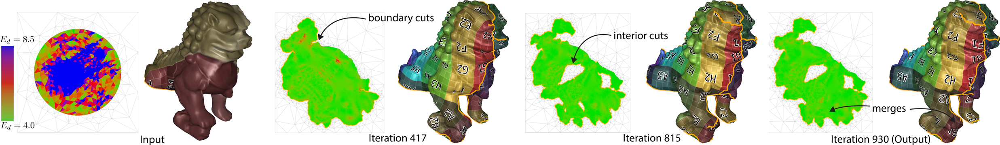

# OptCuts
OptCuts, a new parameterization algorithm,  jointly optimizes arbitrary embeddings for seam quality and distortion. OptCuts requires no parameter tuning; automatically generating mappings that minimize seam-lengths while satisfying user-requested distortion bounds.

<http://www.cs.ubc.ca/labs/imager/tr/2018/OptCuts/>

## Clone Repository
```
git clone --recursive https://github.com/liminchen/OptCuts
```
Then in OptCuts folder there will be
* src: source code
* ext/: external libraries including Intel TBB (as git submodule) and libigl (an older version)
* display/: html code for display results
* OptCuts.xcodeproj: XCode project file
* build.py: a python script to automatically building OptCuts using cmake
* batch.py: a python script to automatically run a batch of examples provided under input/
* display.py: a python script to automatically generate html files for display results
* input/: input meshes
* output/: (will be created) contains output of each input in separate subfolders
* CMakeLists.txt and cmake/: cmake files

## Compile and Run
* Build
```
cd OptCuts
python build.py
```

* Run
```
python batch.py
```
This will run OptCuts on all the triangle meshes directly under input/, where by default bimba_i_f10000.obj will be processed as a "hello world" example. By default batch.py will launch OptCuts with a visualization window (mode 10).

Note that OptCuts takes input meshes with only one connected component. For meshes with multiple connected components, OptCuts can be independently applied on each of the component.

* Display

After finish running OptCuts, the results will be saved under output/ with separate folders per input. Then you can do
```
python display.py
```
to generate html files that will display all the completed results in output/ and open visualize/visualize.html to view them.

## Command Line Arguments
Format: progName mode inputMeshPath lambda_init testID methodType distortionBound useBijectivity initialCutOption [anyStringYouLike]

Example: ./build/OptCuts_bin 10 input/bimba_i_f10000.obj 0.999 1 0 4.1 1 0 firstTrial
* progName
  * ./build/OptCuts_bin
* mode
  * 0: OptCuts with real-time optimization mode, UV coordinates change in each inner iteration will be visualized, need user to start/restart and pause the process via '/' key
  * 10: OptCuts with offline optimization mode, only UV cooridinates change after each alternation between geometry and topology step will be visualized
  * 100: OptCuts with headless mode, no visualization, only command line prints and text file output
  * 1: diagnostic mode, for unit test
  * 2: mesh processing mode, for unit test
* inputMeshPath
  * can be either absolute path or relative path to global variable meshFolder in main.cpp
  * .obj and .off are supported
* lambda_init
  * 0: minimize Symmetric Dirishlet energy with initial cuts, methodType must also be set to 4
  * (0,1): joint optimization. OptCuts start with 0.999 and iteratively update it according to the distortions of intermediate UV maps; 0.025 works generally well for OptCuts with fixed lambda (no dual step) on all inputs.
* testID (initial homotopy parameter)
  * It serves as a classification ID for our visualization webpage
* methodType
  * 0: OptCuts, must also have 0 < lambda < 1
  * 1: EBCuts, using the extremity-boundary cutting strategy from Geometry Images within OptCuts framework
  * 2: OptCuts with fixed lambda, must also have 0 < lambda < 1
  * 3: Ed minimization with the initial seams
* distortionBound
  * (4, inf): distortion bound bd on Symmetric Dirichlet energy Ed
* useBijectivity
  * 0: no bijectivity
  * 1: enforce bijectivity
* initialCutOption
  * 0: random one-point initial cut for genus-0 closed surfaces
  * 1: farthest two-point initial cut for genus-0 closed surfaces
* anyStringYouLike
  * optional, the appended string to the name of a folder to be created for holding all output files

## Output Files
Our program will automatically create a folder according to the input command line arguments under the path given by 
global variable outputFolderPath in main.cpp for holding all output files for the current input:
* 0.png: initial UV map, colored by distortion (blue -> green: highly distorted -> isometric)
* anim.gif: UV map changes during optimization process, colored by distortion
* finalResult.png: output UV map, colored by distortion
* finalResult_mesh.obj: input model with output UV
* 3DView0_distortion.png: input model visualized with checkerboard texture and distortion color map
* 3DView0_seam.png: input model visualized with seams and importance if regional seam placement is requested
* energyValPerIter.txt: energy value of Ew, Ed, Es, and lambda of each inner iteration
* gradientPerIter.txt: energy gradient of Ed of each inner iteration
* info.txt: parameterization results quality output for webpage visualization
* log.txt: debug info

## Keyboard Events:
* '/': start/restart or pause the optimization
In offline optimization mode (100), optimization is started with the program, 
while in real-time optimization mode (0), optimization needs to be started by the user.
* '0': view input model/UV
* '1': view current model/UV
* 'u': toggle viewing model or UV, default is UV
* 'd': toggle distortion visualization, default is ON
* 'c': toggle checkerboard texture visualization, default is OFF
* 's': toggle seam visualization, default is ON
* 'b': toggle lighting, default is OFF
* 'p': toggle viewing seam corners (drawn as black dots), default is ON
* 'o': take a screenshot and save the model with current UV
